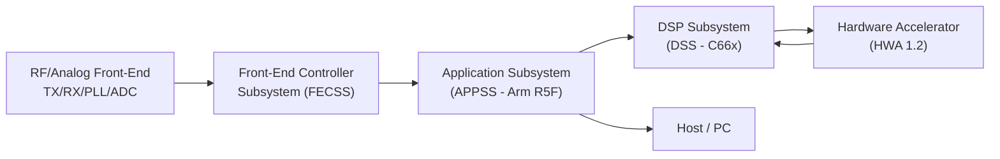
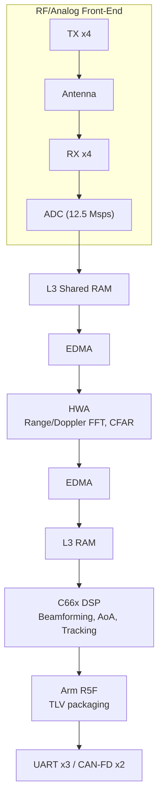
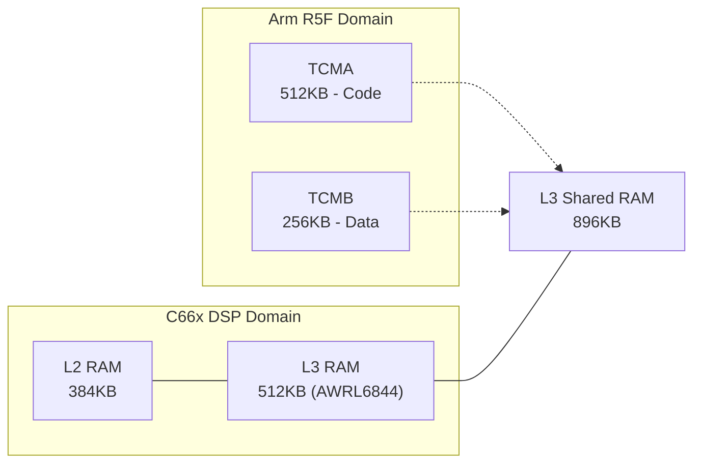
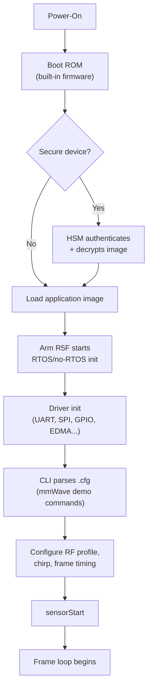
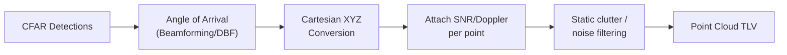
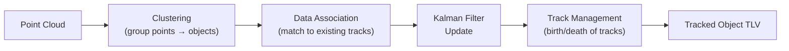
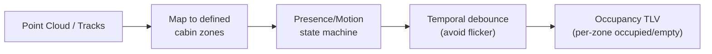
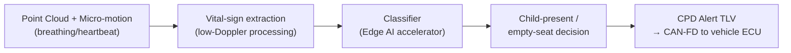

# AWRL6844 Complete Embedded Guide

> Visual-first reference for the AWRL6844 mmWave radar SoC and its embedded software stack.
> Structure: 90% tables/diagrams, 10% short text.
> Specs below are pulled from TI's official AWRL6843/AWRL6844 datasheet (Rev. A, 16 Dec 2025) and the xWRL68xx Technical Reference Manual — not placeholder numbers.

```text
AWRL6844 Complete Embedded Guide
│
├── 01 Hardware Overview
├── 02 Chip Architecture
├── 03 Memory Architecture
├── 04 Boot Process
├── 05 Radar Signal Flow
├── 06 Data Flow
├── 07 Processing Pipeline
├── 08 UART Protocol
├── 09 TLV Types
├── 10 SDK Architecture
├── 11 Driver Layer
├── 12 Memory Flow
├── 13 EDMA Flow
├── 14 HWA Flow
├── 15 Point Cloud Pipeline
├── 16 Tracking Pipeline
├── 17 Occupancy Pipeline
├── 18 CPD Pipeline (Child Presence Detection)
├── 19 Performance
└── 20 Applications
```

---

# 01 Hardware Overview

| Parameter | Value |
|---|---|
| Frequency range | 57 – 64 GHz (7 GHz continuous bandwidth) |
| RX channels | 4 |
| TX channels | 4 (AWRL6843 has 3) |
| ADC sample rate (max) | 12.5 Msps |
| TX output power | ~12.5 dBm typical |
| RX noise figure | ~12.5 dB typical |
| Phase noise @ 1MHz | -90.5 dBc/Hz typical |
| Package | FCCSP, 207-ball BGA, 9.1mm x 9.1mm, 17x17 grid |
| Process node | 45nm RF CMOS |
| Operating (junction) temp | -40°C to 140°C |
| Primary clock | 40.0 MHz crystal (or external square/sine) |
| Low-power clock | 32 kHz internal oscillator |
| Qualification | AEC-Q100 (automotive) |
| Functional safety | ASIL B targeted (ISO 26262) |
| Security | ISO21434 CAL2-targeted, on-chip HSM (secure variants) |



The device is split into **four independently switchable power domains**: RF/analog subsystem, FECSS (front-end controller), APPSS (application, Arm R5F), and DSS (DSP subsystem). This lets firmware power down unused blocks between radar frames — the core of the chip's low-power design.

---

# 02 Chip Architecture

| Processing Element | Role | Clock |
|---|---|---|
| Arm Cortex-R5F | System control, boot, CLI parsing, sensor configuration, TLV packet assembly, UART output | 200 MHz |
| C66x DSP | Radar algorithms: beamforming, AoA, point cloud generation, tracking, Kalman filtering | 450 MHz |
| HWA 1.2 (Hardware Accelerator) | FFT, log-magnitude, CFAR — fixed-function radar math, offloaded from DSP | 200 MHz |
| Arm Cortex-M4 (HSM, secure variants only) | Hardware Security Module — secure boot, key management, crypto | — |



---

# 03 Memory Architecture

> Corrected against the datasheet — the AWRL6844 has **2.5 MB** total on-chip RAM (2 MB on AWRL6843). This is a low-power radar MCU, not a general-purpose SoC — there is no external DDR.

| Memory Block | Size | Owner | Purpose |
|---|---|---|---|
| R5F TCMA | 512 KB | Arm R5F | Program code (tightly-coupled) |
| R5F TCMB | 256 KB | Arm R5F | Data / stack (tightly-coupled) |
| DSS L2 RAM | 384 KB | C66x DSP | Fast local working memory (FFT intermediates) |
| DSS L3 RAM | 512 KB | C66x DSP | Radar cube / larger buffers (**AWRL6844 only**, not on AWRL6843) |
| DSS L3 Shared RAM | 896 KB | DSP / R5F / HWA | Shared buffers, can also back TCMs |
| **Total on-chip RAM** | **2.5 MB** | — | AWRL6844 (2.0 MB on AWRL6843) |



There is no separate "ACCEL_MEM" bank called out in the datasheet as a distinct named memory — HWA operates on buffers carved from L2/L3/Shared RAM via EDMA, configured per use case in the SDK's memory map (linker command file), not a fixed hardware region.

---

# 04 Boot Process



| Stage | Description |
|---|---|
| Boot ROM | Immutable on-chip firmware; validates and loads the application |
| Secure boot (HSM) | On secure part variants, an embedded Arm Cortex-M4 HSM authenticates/decrypts the image using customer root keys before release to R5F |
| Driver init | UART, SPI/QSPI, CAN-FD, I2C, GPIO, EDMA, HWA drivers brought up |
| CLI / .cfg | Sensor configuration commands (profile, chirp, frame, guiMonitor, etc.) parsed over UART |
| sensorStart | Triggers the RF front end and begins the continuous frame-processing loop |

---

# 05 Radar Signal Flow

```text
TX Chirp (57-64GHz, 7GHz BW)
      │
      ▼
Reflection off target
      │
      ▼
RX (x4 channels)
      │
      ▼
ADC (12.5 Msps, per RX channel)
      │
      ▼
Range FFT   (HWA)
      │
      ▼
Doppler FFT (HWA)
      │
      ▼
CFAR detection (HWA)
      │
      ▼
Angle of Arrival / Beamforming (DSP)
      │
      ▼
Point Cloud (DSP)
      │
      ▼
Tracking / Kalman Filter (DSP)
      │
      ▼
Classification (DSP, optional Edge AI)
      │
      ▼
TLV packet build (R5F)
      │
      ▼
UART / CAN-FD output
```

---

# 06 Data Flow

```text
                    ARM Cortex-R5F
                          │
              Configure everything
                          │
                          ▼
                  RF front end captures
                     ADC samples
                          │
                          ▼
                  L3 Shared Memory
                          │
                          ▼
                   EDMA moves data
                          │
                          ▼
              HWA performs FFT + CFAR
                          │
                          ▼
                  EDMA moves results
                          │
                          ▼
           DSP extracts point cloud/tracks
                          │
                          ▼
         R5F builds UART/CAN-FD TLV packets
                          │
                          ▼
                Host / PC Visualizer
                          │
                          ▼
                 Repeat next frame
```

**Pipelining note:** these stages overlap across frames. While HWA processes frame *N*, EDMA may already be moving data for frame *N+1*, DSP may still be tracking objects from frame *N−1*, and R5F may be preparing the next frame's configuration. This overlap is what lets the AWRL6844 hit real-time frame rates on a 200/450 MHz core pair.

---

# 07 Processing Pipeline

| Stage | Engine | Typical Output |
|---|---|---|
| Windowing | HWA | Windowed ADC samples |
| Range FFT | HWA | Range bins per chirp |
| Doppler FFT | HWA | Range-Doppler (radar cube) |
| Log-magnitude | HWA | Detection-ready magnitude map |
| CFAR (CA-CFAR) | HWA | Candidate detections |
| Angle estimation (AoA/DBF) | DSP | Azimuth/elevation per detection |
| Point cloud formation | DSP | (x, y, z, doppler, SNR) list |
| Clustering / tracking | DSP | Tracked object list + Kalman state |
| Classification (optional) | DSP + Edge AI accelerator path | Object class / occupancy state |
| TLV packaging | R5F | Serialized output packet |

---

# 08 UART Protocol

```text
┌───────────────────────────────┐
│ Magic Word (8 bytes)          │
├───────────────────────────────┤
│ Version                       │
├───────────────────────────────┤
│ Total Packet Length           │
├───────────────────────────────┤
│ Platform                      │
├───────────────────────────────┤
│ Frame Number                  │
├───────────────────────────────┤
│ CPU Cycles / Timestamp        │
├───────────────────────────────┤
│ Num Detected Objects          │
├───────────────────────────────┤
│ Num TLVs                      │
├───────────────────────────────┤
│ Subframe Number               │
├───────────────────────────────┤
│ TLV #1 (Type, Length, Value)  │
│ TLV #2                        │
│ TLV #3 ...                    │
└───────────────────────────────┘
```

| Host Interface | Count | Notes |
|---|---|---|
| UART | 3 | Primary CLI + output data path |
| CAN-FD | 2 | Automotive in-vehicle networking |
| SPI | 2 | Alternate host link |
| LIN | 1 | Automotive body-network option |
| LVDS | — | Raw ADC capture (development/debug) |

---

# 09 TLV Types

| TLV | Description | Used For |
|---|---|---|
| Point Cloud | XYZ + Doppler + SNR per detected point | Visualization |
| Side Info | SNR/noise per point | Quality filtering |
| Statistics | CPU load, margin, temperature | Performance monitoring |
| Range/Doppler Heatmap | 2D matrix | Debug / tuning |
| Tracked Object List | Position, velocity, Kalman state per track | Tracking |
| Occupancy / Presence State | Zone occupancy flags | In-cabin presence apps |
| Classifier Output | Class label + confidence | Child presence / object classification |

*(Exact TLV type IDs and struct layouts are defined per-demo in the SDK's `mmw_output.h` — confirm against the specific demo/version you're building against before hardcoding parsers.)*

---

# 10 SDK Architecture

The current SDK for this device family is **MMWAVE-L-SDK** (latest: 06.01.00.05, released 15 Dec 2025), covering both FreeRTOS and no-RTOS operation on the R5F and C66x DSP.

```text
Application (custom or demo)
        │
CLI Commands (.cfg parser)
        │
Demo Layer (out-of-box demo, low-power visualizer GUI)
        │
DPUs (Data Processing Units — modular algorithm blocks)
        │
Drivers (EDMA, HWA, UART, GPIO, SPI, QSPI, CAN-FD, I2C)
        │
Hardware (R5F, C66x DSP, HWA, RF front end)
```

| SDK Component | Purpose |
|---|---|
| Driver packages | Integrated drivers for all peripherals and accelerators |
| Power management framework | Exercises device low-power modes across use cases |
| AFE layer | Layered API for analog front-end (RF) programming |
| DPUs | Reusable, swappable processing blocks (range proc, CFAR, AoA, tracker, etc.) |
| RTOS support | FreeRTOS or no-RTOS on both R5F and C66x |
| Tooling | Code Composer Studio (CCSTUDIO), SysConfig for code generation |

---

# 11 Driver Layer

| Driver | Peripheral | Notes |
|---|---|---|
| EDMA driver | EDMA controller | Zero-CPU-overhead memory-to-memory transfers |
| HWA driver | Hardware Accelerator | Configures FFT/CFAR/log-mag pipelines |
| UART driver | 3x UART | CLI + streaming output |
| CAN-FD driver | 2x CAN-FD | Automotive networking |
| SPI/QSPI driver | 2x SPI, 1x QSPI | Host link / external flash |
| GPIO driver | 8x GPIO | General purpose I/O, sync signals |
| I2C driver | I2C | Sensor/peripheral bus |
| GPADC driver | 4x GPADC | Analog monitoring |
| PWM driver | PWM interface | Auxiliary control |

---

# 12 Memory Flow

```text
ADC Samples → L3 Shared RAM → EDMA → HWA working buffers
(in L2/L3)  → HWA compute → EDMA → L3 RAM (results)
          → DSP reads from L3 → L2 for working set
          → R5F reads DSP output from Shared RAM → TCMB
```

Because there is **no external memory**, every buffer — radar cube, point cloud, track list, TLV staging — must be sized to fit inside the 2.5 MB on-chip budget. This is the single biggest constraint driving frame-rate, antenna count, and range-resolution trade-offs in application configuration.

---

# 13 EDMA Flow

```text
ADC Buffer (L3 Shared RAM)
        │
        ▼
      EDMA
        │
        ▼
HWA-accessible memory (L2/L3 region)
        │
        ▼
   HWA computes FFT
        │
        ▼
      EDMA
        │
        ▼
   L3 RAM (FFT/CFAR output)
        │
        ▼
   DSP (C66x) consumes
```

EDMA is the backbone that lets HWA, DSP, and R5F operate on the same frame's data without CPU-driven copies — critical given the 200/450 MHz clocks and tight power budget.

---

# 14 HWA Flow

```text
ADC Samples
      │
      ▼
   HWA 1.2
      │
 ┌────┴────┐
 │Windowing│
 │Range FFT│
 │Doppler  │
 │FFT      │
 │Log-Mag  │
 │CFAR     │
 └────┬────┘
      │
      ▼
Detections + Radar Cube
      │
   (via EDMA)
      ▼
     DSP
```

HWA 1.2 runs at 200 MHz and offloads the fixed, repetitive radar math (FFTs, log-magnitude, CFAR) so the C66x DSP is free for the more irregular workloads: angle estimation, clustering, tracking, and classification.

---

# 15 Point Cloud Pipeline



---

# 16 Tracking Pipeline



---

# 17 Occupancy Pipeline



Motion and presence detection is documented by TI as a discrete state machine with configurable transition timers — this is the block referenced above.

---

# 18 CPD Pipeline (Child Presence Detection)



Child presence detection is one of the AWRL6844's named target use cases, alongside seat-belt reminders and low-power intrusion monitoring, and it leans on the on-chip **Edge AI accelerator** for classification.

---

# 19 Performance

| Resource | Budget | Notes |
|---|---|---|
| R5F clock | 200 MHz | Control, CLI, TLV packaging |
| DSP clock | 450 MHz | Point cloud, tracking, classification |
| HWA clock | 200 MHz | FFT / CFAR pipeline |
| ADC sample rate | 12.5 Msps max | Per RX channel |
| On-chip RAM | 2.5 MB total | No external DDR — hard ceiling on cube size/frame rate trade-off |
| Power domains | 4 independently switchable | RF/analog, FECSS, APPSS, DSS |
| Low-power modes | Idle, deep sleep | Memory-retention options across modes |

Performance tuning is fundamentally a memory-budget problem on this device: increasing range bins, Doppler bins, or antenna count increases radar-cube size, which competes directly with L2/L3/Shared RAM against tracker state, TLV staging buffers, and (if used) classifier model weights.

---

# 20 Applications

| Application | Primary Pipeline Used |
|---|---|
| Child presence detection (CPD) | Point Cloud → Vital Sign → Classifier (§18) |
| Seat-belt reminder | Occupancy / presence pipeline (§17) |
| Intrusion monitoring | Point Cloud + Tracking, low-power idle/deep-sleep between frames |
| Occupancy localization & classification | Point Cloud → Tracking → Classification |
| General in-cabin sensing | Full pipeline (§05–§07) |

---
## Sources

### Official Texas Instruments (Primary References)

1. **AWRL6844 mmWave Radar Sensor – Product Page**  
   https://www.ti.com/product/AWRL6844

2. **AWRL6843 / AWRL6844 Single-Chip 60-GHz mmWave Sensor Datasheet (Rev. A)**  
   https://www.ti.com/lit/ds/symlink/awrl6844.pdf

3. **xWRL68xx Technical Reference Manual (TRM) (Rev. A)**  
   https://www.ti.com/lit/pdf/swru610

4. **MMWAVE-L-SDK 6.1 Release Notes (v06.01.00.05)**  
   https://www.ti.com/tool/MMWAVE-L-SDK

5. **MMWAVE-L-SDK Documentation**
   https://dev.ti.com/tirex/explore/node?node=A__AN9Xy8i.4r5P6g8g6CzjBQ__MMWAVE_L_SDK__VLyFKFf__LATEST

6. **mmWave-L-SDK API Guide**
   (Available inside the installed SDK documentation)

---

### Development Tools

7. **Code Composer Studio (CCS)**
   https://www.ti.com/tool/CCSTUDIO

8. **SysConfig**
   https://www.ti.com/tool/SYSCONFIG

9. **UniFlash**
   https://www.ti.com/tool/UNIFLASH

10. **TI Resource Explorer**
    https://dev.ti.com/tirex/

---

### Additional Technical References

11. **TI mmWave Training Series**
    https://training.ti.com/mmwave-training-series

12. **TI E2E Support Forum**
    https://e2e.ti.com/

13. **TI Precision Labs – Radar**
    https://training.ti.com/ti-precision-labs-radar

14. **TI Application Notes and Design Guides**
    https://www.ti.com/radar

15. **Radar Toolbox**
    https://www.ti.com/tool/MMWAVE-RADAR-TOOLBOX

